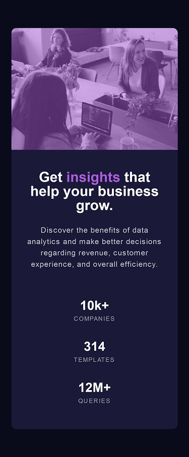

# Frontend Mentor - Stats preview card component solution

This is a solution to the [Stats preview card component challenge on Frontend Mentor](https://www.frontendmentor.io/challenges/stats-preview-card-component-8JqbgoU62). Frontend Mentor challenges help you improve your coding skills by building realistic projects. 

## Table of contents

- [Overview](#overview)
  - [The challenge](#the-challenge)
  - [Screenshot](#screenshot)
  - [Links](#links)
- [My process](#my-process)
  - [Built with](#built-with)
  - [Useful resources](#useful-resources)
- [Author](#author)

## Overview

### The challenge

Users should be able to:

- View the optimal layout depending on their device's screen size

### Screenshot

### Links

- Solution URL: [Frontend Mentor solution](https://www.frontendmentor.io/solutions/stats-preview-card-component-f2F5gTtdsa)
- Live Site URL: [Live site at Netlify](https://auriga-stats-preview-card.netlify.app/)

## My process

### Built with

- Semantic HTML5 markup
- CSS custom properties
- Flexbox
- Mobile-first workflow
- BEM

### Useful resources

- [Code Chrysalis Channel](https://www.youtube.com/watch?v=mVY-droiaoA&t=196s) - This is video on Youtube which helped me finally understand BEM. I'd recommend it to anyone still learning this concept.

## Author

- Frontend Mentor - [@auriga2124](https://www.frontendmentor.io/profile/auriga2124)
- Twitter - [@ErkaRahman](https://twitter.com/ErkaRahman)
